# ML and AI for Weather, Climate and Environment Training

## Prerequisites

- Python 3.10 or higher (ideally 3.12)
- Git (for the course materials submodule)
- uv (for Python env and deps)

Provided by the virtual environment setup:

- Pip
- PyTorch
- NumPy
- Matplotlib
- Jupyterlab
- requests
- ecCodes

## Course Scope

- Internal ECMWF training on Python, machine learning and artificial intelligence
- Applications to weather, climate and environmental science
- Instructor: Roland Potthast, Director for Meteorological Modelling and Analysis, Deutscher Wetterdienst (DWD)
- Material: <https://github.com/eumetnet-e-ai/e-ai_ml2>

Course materials are included as a git submodule at `e-ai_ml2`. To fetch them:

```bash
git submodule update --init --recursive
```

Create and activate the virtual environment with `uv` (uses `pyproject.toml`):

```bash
uv venv
source .venv/bin/activate
uv sync
```

## Introduction

- Coding and science in the age of AI
- General coding rules and strategy
- Overview of five days: Python and AI

## Python Startup: Basics

- Installation, virtual environments, pip, imports
- Dependency management with `requirements.txt`
- NumPy fundamentals
- Plotting with Matplotlib
- Functions
- Python essentials

## Jupyter Notebooks, APIs and Servers

### Jupyter notebooks

- Use in a venv; if `pip`-installing extra packages _within_ the notebook, use:

  ```python
  %pip install package-name
  ```

  to guarantee the correct environment, rather than:

  ```python
  !pip install package-name
  ```

  which uses the system `pip`.
- This:

  ```python
  import sys
  !{sys.executable} -m pip install package_name
  ```

  does the same less concisely.
- Remote notebooks:
  - On remote machine:

    ```bash
    mkdir test-remote-notebook
    cd test-remote-notebook
    python3 -m venv .venv
    source .venv/bin/activate
    python3 -m pip install --upgrade pip jupyterlab
    jupyter lab --no-browser --port=8888
    ```

  - Note the port actually used (might not be 8888)
  - If necessary note the token from the output, or check using either of:

    ```bash
    jupyter lab list
    jupyter server list
    ```

  - On local machine, set up SSH tunnel and open in browser:

    ```bash
    ssh -N -L 9001:localhost:8888 user@remote-host &
    open http://localhost:9001<?token=...>
    ```

- List magic commands:

  ```python
  %lsmagic
  ```

- Capture output of a cell (suppress display):

  ```python
  %%capture
  ```

- Auto-reload imported modules on change:

  ```python
  %load_ext autoreload
  %autoreload 2
  ```

  Set to 1 to reload only modules imported with `%aimport` (where `%aimport` is used to specify which modules to autoreload).
- Enable Mermaid diagrams (using using a `%%mermaid` cell magic):

  ```python
  %load_ext mermaid_magic
  ```

- Enable JS diagrammers (e.g. for plotting neural networks):

  ```python
  %load_ext nb_js_diagrammers
  ```

  (Mermaid but also Flowchart.js, D3, etc.) Use this for multiple diagram types including Mermaid (in which case `%%mermaid_magic` not needed).
- If using `%pip install -e` in a Jupyter notebook, you must restart the kernel afterwards.
  - Editable installs work by creating `.pth` files that add source paths to `sys.path`
  - Python only processes `.pth` files once at startup
  - A running kernel won't see new paths until restarted
  - Non-editable packages work immediately because they install directly into `site-packages/`, which is already in `sys.path`

### APIs and API design

- APIs as a scaling principle
  - Systems can grow without rewrites
  - Shift complexity behind a stable boundary
- API requests using `requests`

### Fortran integration via `ctypes`

- Calling compiled code from Python
- `ctypes`: language binding in Python that can load C functions from shared libs or DLLs on the fly
- `pybind11` - modern C++ bindings

## ecCodes, GRIB, Open Data, NetCDF, Visualisation

- GRIB is message-based, not "one tidy array per file"; typically select messages by metadata keys
- Alternatives:
    - NetCDF (human readable, more widely used, tool support)
    - Zarr (chunked, cloud-native, parallel access; ML-friendly)
- GRIB advantages
    - Operational standard for weather data exchange
    - Encoding efficient still(?) unmatched

### ecCodes GRIB library

- ecCodes: core library/tooling for decoding/encoding GRIB/BUFR
- In Python, use either:
  - [`eccodes-python`][eccodes-py] (low/mid-level bindings), or
  - higher-level wrappers (e.g. [`pygrib`][pygrib])
- Installation of `eccodes-python` via `pip install eccodes` includes ecCodes binary library
  - Supplied by `eccodeslib` package on Linux and MacOS
  - Means no external ecCodes binary library required
- Common practical pattern: load GRIB → map to something `xarray`-friendly (often via [`cfgrib`][cfgrib]) → plot/slice
- `cfgrib`: Python interface to map GRIB files to NetCDF Common Data Model following CF Convention using ecCodes
- A GRIB file contains many messages; you filter by keys (parameter, level, time, grid), then pull values
- The difference in general: NetCDF more "dataset-like"; GRIB more "bulletin/message-like"
- Alternatives
  - `xarray` with `cfgrib` engine:

    ```python
    import xarray as xr
    ds = xr.open_dataset('file.grib2',engine='cfgrib')
    ```

  - Use `cdo` to convert GRIB to NetCDF if needed:

    ```bash
    cdo -f nc copy input.grib output.nc
    ```

  - Will have to regrid anything not on a regular grid (e.g. native IFS data in reduced Gaussian or cubic octohedral) to convert to NetCDF
  - Soon `cfgrib` will be discontinued in favour of EarthKit:

    ```python
    import earthkit as ek
    ds = ek.data.from_source("file", "my_data.grib")
    xs = ds.to_xarray()

    # or equivalently:

    ds = xr.open_dataset('file.grib2', engine='earthkit')
    ```

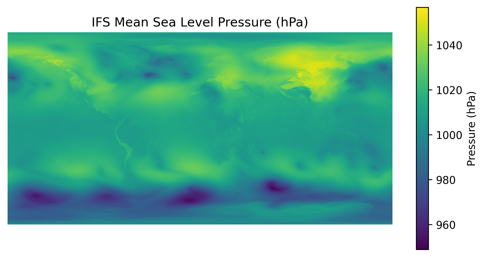
_Figure: IFS mean sea-level pressure field plotted from a GRIB file using ecCodes._

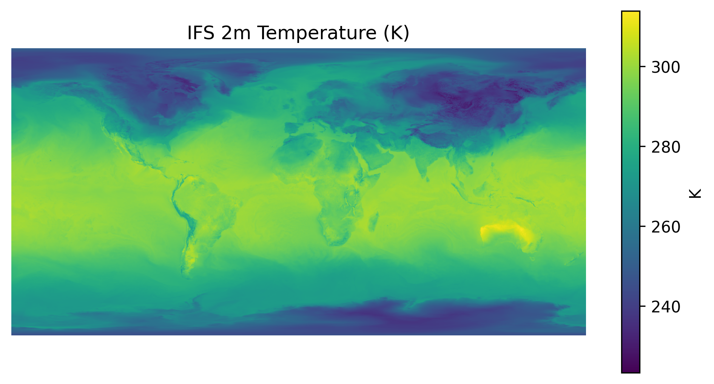
_Figure: IFS 2m temperature field loaded from GRIB and plotted via ecCodes._

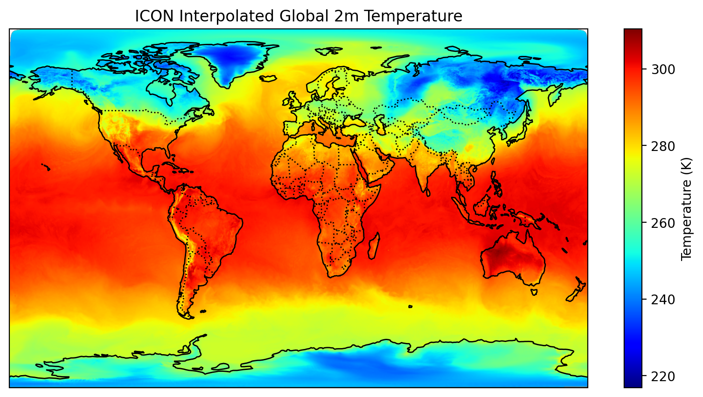
_Figure: ICON 2m temperature interpolated to a global grid._

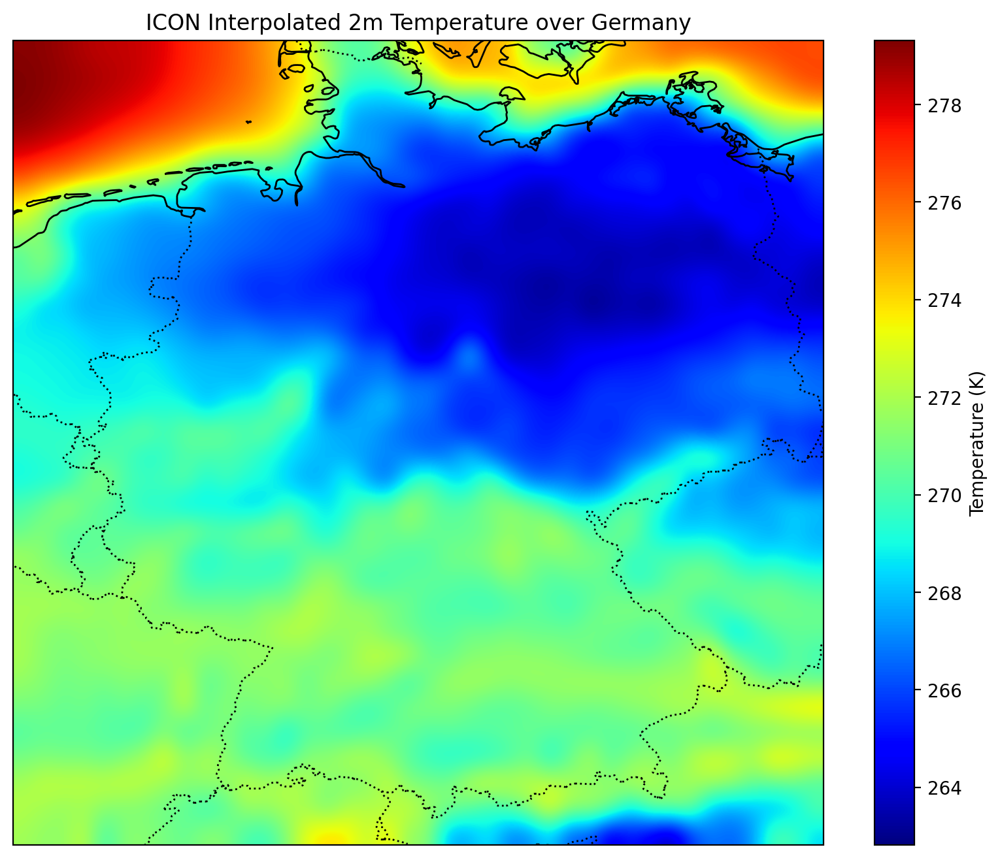
_Figure: ICON 2m temperature interpolated over Germany._

### SYNOP observations from NetCDF

- SYNOP: WMO code for weather-station observations (surface synoptic observations)
  - Typically at standard synoptic hours (often 00/06/12/18 UTC, sometimes more frequently depending on network)
  - Sent by DWD, fixed/mobile and staffed/automated stations (>10,000)
  - Temperature, pressure, visibility, etc
  - SYNOP (FM-12) for land stations; related surface report types include SHIP (FM-13) and BUOY (FM-18)
  - Operational exchange moving from alphanumeric SYNOP code towards BUFR (table-driven format)


_Figure: SYNOP temperature observations in EuroPP projection._


_Figure: SYNOP temperature observations in a geostationary projection._

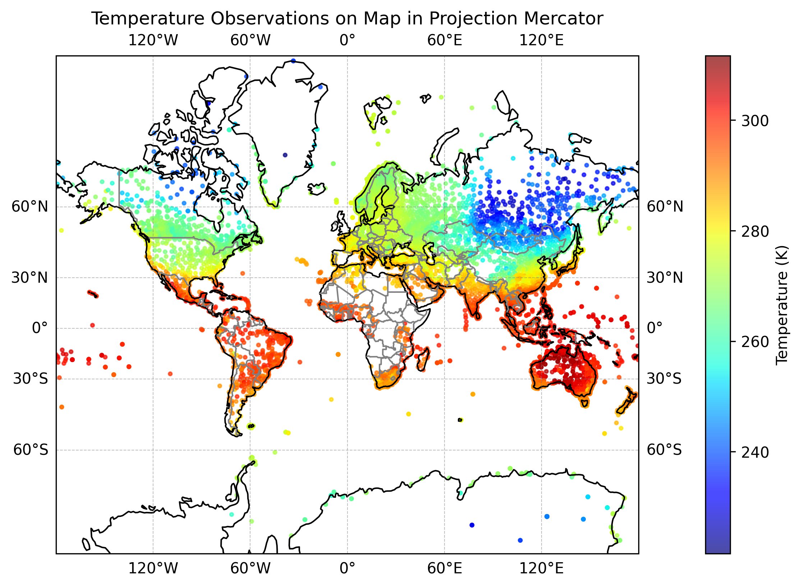
_Figure: SYNOP temperature observations in Mercator projection._


_Figure: SYNOP temperature observations in Plate Carree projection._


_Figure: SYNOP temperature observations in a stereographic projection._


_Figure: SYNOP temperature observations in Transverse Mercator projection._

### AIREP feedback file analysis

- AIREP: aircraft reports
  - Weather observations from aircraft in flight
  - Majority of AIREPs report wind and temperature at selected intervals along the flight route
  - Sampling follows air traffic routes, highly inhomogeneous horizontal coverage
  - Some aircraft equipped with sensors for humidity/water vapour, turbulence, icing
- Feedback file
  - After assimilation step a feedback file is created
  - Contains all relevant information regarding use and impact of observations in the assimilation
  - Enables detailed diagnostic studies to be carried out on performance of assimilation and observing systems
  - Feedback files used as input to periodic offline bias correction updates


_Figure: Example AIREP aircraft observations plotted from feedback data._

### GPU access in practice

- Python backends
    - CUDA (NVIDIA)
    - MPS / Metal (Apple)
    - CPU fallback (always available)
- Development vs. production
    - Development: local machine, laptop with discrete GPU or Apple Silicon
    - Production: cloud VM with GPU, or on-prem HPC with GPU nodes
    - Code *must be portable across backends and environments*

## Basics of Artificial Intelligence and Machine Learning

### Core AI and ML concepts


### Torch tensors

- Primarily an $n$-dimensional array (like NumPy’s `ndarray`) plus:
  - `dtype` (`float32`, `float64`, etc.)
  - device (CPU/GPU)
  - optional gradient tracking (`requires_grad=True`) - i.e. differentiable
  - library of vectorised ops, broadcasting, indexing, etc.
- Deep learning uses lots of multi-indexed quantities: batches × channels × height × width, sequences × features, ...
  - Calling them "tensors" convenient shorthand for "high-dimensional array"
- Treat `torch.Tensor` as an efficient array with automaticx differentiation
- "Gradient tracking" (autograd) means the tensor can participate in automatic differentiation
  - I.e. so PyTorch can compute derivatives of a scalar loss with respect to that tensor
- Create tensor with `requires_grad=True`, and PyTorch will then:
  - Record the operations applied to it (a computation graph),
  - Then (when you call `.backward()` on a scalar result, typically the loss) use chain rule to compute gradients, e.g. for tensor $x$:
    $$
    \frac{\partial}{\partial x} \mathrm{loss}
    $$
  - Gradients end up in `.grad` field of the tensors being optimised
- Leaf tensors are those created by the user (not results of operations)
  - Only leaf tensors with `requires_grad=True` will have their `.grad` populated during backpropagation
  - Intermediate tensors will only keep gradients if you call `.retain_grad()` on them

### Data handling

- Training uses batches
- PyTorch's `DataLoader` provides:
    - Batching
    - Shuffling (optional but recommended)
    - Parallel loading (where Zarr comes in, with chunked data)
- Experience shows batches more efficient than single samples or full dataset
- "Features": ML terminology for input values
- "Labels": ML terminology for output/target values
- $N$ is number of samples in batch
- $d$ is number of features per sample
- $N \times d$ tensor for batch of $N$ samples, each with $d$ features
- For labels:
    - $N$-vector for regression (one target per sample)
    - $k$ is the number of labels for each output

### PyTorch fundamentals: model, loss, optimiser

- Tensor shapes and broadcasting (most bugs are shape bugs)

- Autograd: what has gradients, when to `.detach()`, why `.zero_grad()` exists
- Gradient tracking typically off for inference/evaluation (saves memory/computation)
  - Use `with torch.no_grad():` context
- When you want a value but don’t want gradients to flow through it: `.detach()`
  - `x_detached = x.detach()`

- Training loop vocabulary: `nn.Module`, forward pass, loss, `optimiser.step()`

- `nn.Module`: base class for models and layers
  - Holds parameters (weights/biases) and allows composition of layers as Python attributes
  - Calling `model(x)` runs its `forward()`

- Model:

  $$
  \hat{y} = W_2 \sigma(W_1 x + b_1) + b_2
  $$

  where:

  - $W_1$, $b_1$, $W_2$, $b_2$ are parameters (weights and biases)
  - $\sigma$ is activation function
  - $x$ is input
  - $\hat{y}$ is prediction

- Forward pass: compute predictions from inputs, e.g. `y_pred = model(x)`
  - Builds autograd graph (if grads enabled)

- Loss: a scalar measuring error, e.g. `loss = criterion(y_pred, y_true)`
  - Training tries to minimise this

- Optimisers:
  - SGD: stochastic gradient descent
  - Adam: adaptive moment estimation (popular default choice)
  - Others: RMSProp, Adagrad, etc.

- `optimiser.step()`: updates model parameters using gradients
  - Gradients currently stored in each parameter’s `.grad` (computed by `loss.backward()`)
  - Uses e.g. SGD/Adam

- Device handling: CPU vs GPU (`.to(device)`), and `dtype` basics

- Debug habits: print shapes, check loss decreasing, overfit a tiny batch


### Simple neural network training

- Training neural networks is "adjust parameters to reduce loss"
- Autograd gives the gradients needed for optimisers

- Typical minimal loop order for training:
  - `optimiser.zero_grad()` (clear old grads as PyTorch accumulates them by default)
  - `y_pred = model(x)` - forward pass, get predictions from inputs (each iteration typically using unique batch of inputs)
  - `loss = criterion(y_pred, y)` - compute scalar loss (error in predictions `y_pred` vs true targets `y`)
  - `loss.backward()` - backpropagation (compute gradients of loss w.r.t. parameters via backpropagation)
  - `optimiser.step()` - learning step (update parameters, i.e. weights/biases, in-place)

### Gradients and decision boundaries

- Decision boundaries
  - In classification tasks, decision boundaries separate different classes in the input space
  - Set of input points where the model is equally likely to assign to multiple classes
  - Separates regions of the input space that the model assigns to different labels
- Binary classification: if model outputs score $f(x)$ and predicts class 1 when $f(x)>0$, then decision boundary is $f(x)=0$
- Linear models (perceptron/logistic regression/linear SVM): decision boundary is a hyperplane (straight line in 2D, plane in 3D)
- Non-linear models (neural networks with hidden layers): decision boundaries complex, non-linear surfaces
  - Neural networks: composing nonlinearities lets them form curved, complex boundaries (often piecewise linear)
- Multi-class (softmax)
  - Boundaries are where top two class scores tie, e.g.
    $$
    s_i(x) = s_j(x)
    $$
  - Full space partitioned into regions for each class

- Decision boundary interpretation:
  - Far from boundary → model usually more confident
  - Near boundary → small input changes can flip prediction (often where errors cluster)
  - Overly complex/simple boundaries sign of over/under-fitting
  - Plot decision boundaries in 2D by evaluating model on a grid and colouring by predicted class

## Neural Network Architectures

- Activation function: non-linear function applied to a layer’s output (usually after a linear transform)
  - What lets neural networks model non-linear relationships
  - Without activations, a stack of linear layers is still just one linear function

- Typical pattern in neural network layer:
  $$
  h = \sigma(Wx + b)
  $$
  - $W$: weight matrix
  - $b$: bias vector
  - $\sigma$: activation function (e.g. ReLU, sigmoid, tanh)
  - $x$: input vector
  - $h$: output vector
  - $Wx + b$: linear transformation
  - $\sigma(...)$: non-linear activation

- Common activation functions:
  - ReLU: $\mathrm{ReLU}(z) = \max(0, z)$ - common default, simple and fast
  - Sigmoid: $\sigma(z) = \frac{1}{1 + e^{-z}}$ - output between 0 and 1; used for binary classification
  - Tanh: $\tanh(z) = \frac{e^{z} - e^{-z}}{e^{z} + e^{-z}}$ - output between -1 and 1; zero-centered
  - Softmax: converts vector to probability distributions; used in multi-class classification
  - Leaky ReLU, ELU, GELU: variants of ReLU to mitigate "dying ReLU" problem; smoother gradients, with small negative slope

- Rule of thumb:
  - Use ReLU or its variants for hidden layers
  - For output layer, task-dependent:
    - Linear for regression output
    - Sigmoid for binary classification output
    - Softmax for multi-class classification output
  - Experiment with different activations if training is unstable or performance poor

---

- Network structure defines the inductive framework
  - Learning is constrained by connectivity

- CNN - convolution $K \star x$
- GNN - sparse matrix

### Feed-forward networks

- Data flows strictly from input to output without loops (no recurrence) - DAG
- No memory (i.e. no state carried between inputs)
- E.g. multi-layer perceptron (MLP), CNN, transformer
- Stacks of linear layers and non-linear activations
- Works on fixed-size feature vectors
- Strong for tabular features and simple classification, regression, function approximation
- Affine transformations followed by non-linear activations
- Each added layer add to the expressive power (i.e. model's ability to approximate complex functions)
- Model's capacity is determined by number of layers and units per layer
  - Number of parameters grows with depth and width
  - Network depth (number of layers)
  - Width (units per layer)
- Risk of overfitting with too much capacity relative to data
- Shallow / wide networks can approximate any function (universal approximation theorem)
- Deep / narrow networks can learn hierarchical features more efficiently

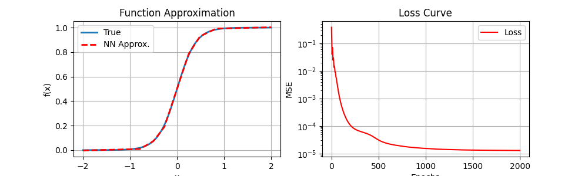
_Figure: Example deep neural network fit on sample data._

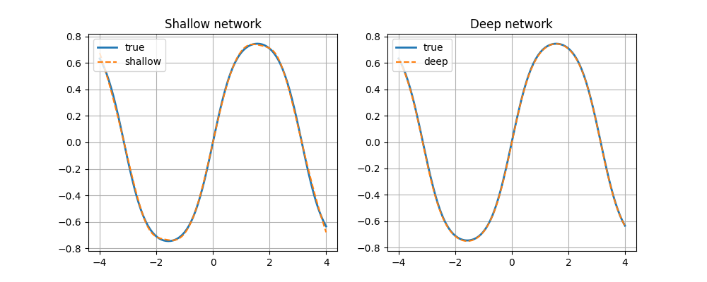
_Figure: Comparison of shallow and deep network decision boundaries._

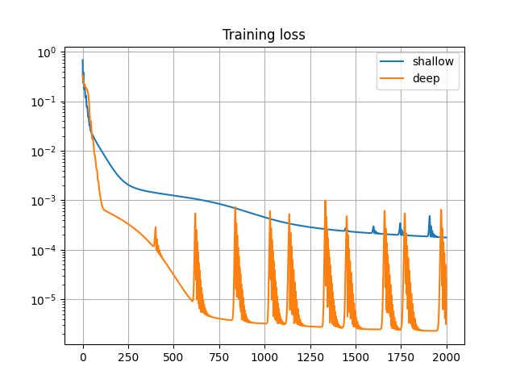
_Figure: Training loss curves for shallow vs deep networks._

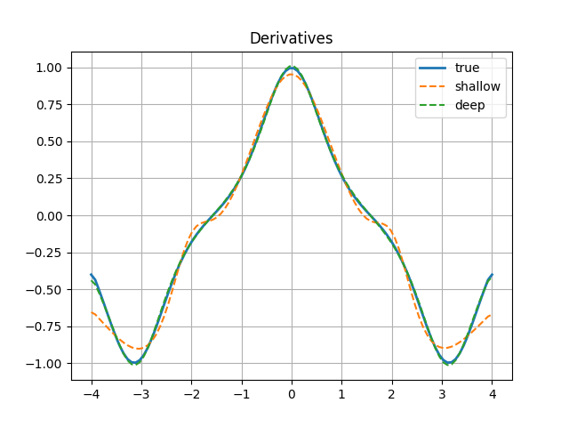
_Figure: Gradient magnitudes across layers for shallow vs deep networks._

### Graph neural networks

- Designed for data that lives on a graph (set of nodes connected by edges)
  - Data points are not independent (e.g. spatial grids, social networks, molecules)
- Good for irregular meshes (e.g. icosahedral grids), sparse observations, and networks
- Graph: $G = (V, E)$ with nodes $V$ and edges $E$ (nodes are entites, edges are relationships)
- Node data: each node has features/attributes, $x_i$ for node $i$
  - May be phyusical states, e.g. temperature, pressure at grid point
- Labels $y_i$
- Aggregate information from neighbours
- Message-passing framework: nodes send/receive messages to/from neighbours, update states:
  - Each node $i$ has a vector of features, $h_i$
  - Each node gathers info from neighbours, $j \in \mathcal{N}(i)$
  - Aggregation step: $m_i = \mathrm{AGGREGATE}(\{h_j : j \in \mathcal{N}(i)\})$
  - Update step: $h_i' = \mathrm{UPDATE}(h_i, m_i)$
- Stacking multiple graph layers lets info propagate further
- Applications in weather/climate:
  - Irregular meshes: e.g. icosahedral/healpix-like grids or unstructured meshes don’t suit standard 2D convolutions
  - Spherical geometry: graph connectivity can represent neighbours on the sphere without pole issues
  - Sparse observations: stations/aircraft/sensors form naturally irregular networks; can treat stations as nodes and connect by proximity
  - Physical structure: can encode known relationships via edges (adjacency, distance, flow direction)

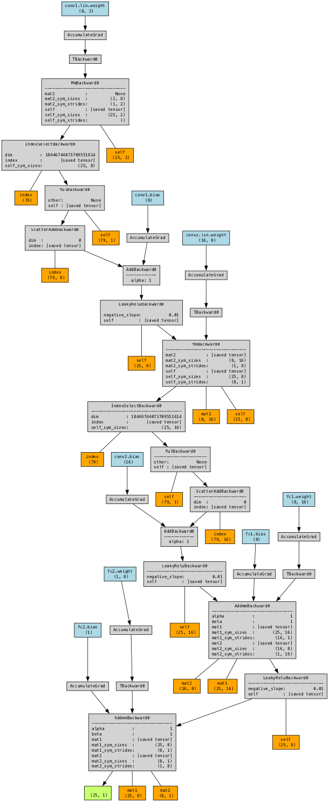
_Figure: Example graph topology used for GNN message passing._


_Figure: Example graph connectivity structure for neighborhood definition._

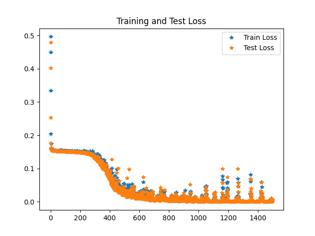
_Figure: Training loss curve for a sample GNN run._

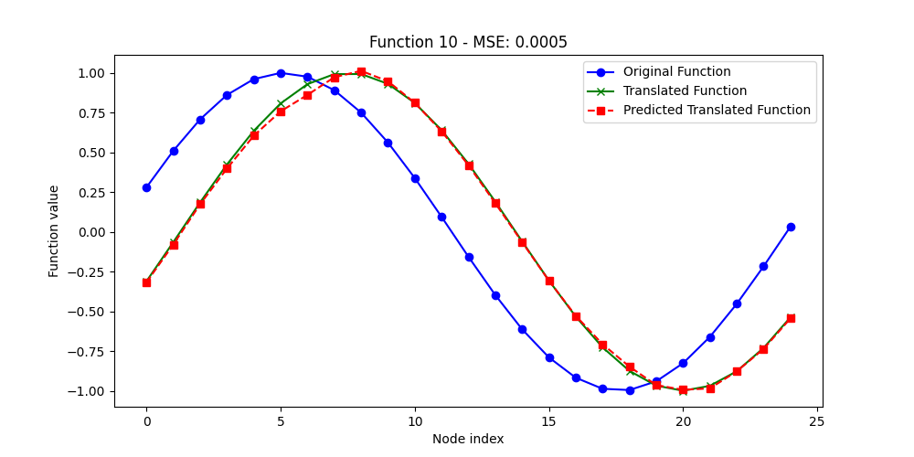
_Figure: GNN test output example 1._


_Figure: GNN test output example 2._

- Variants:
  - GCN (Graph Convolutional Network):
  - GraphSAGE
  - GAT (Graph Attention Network)
  - MPNN (Message Passing Neural Network)
  - Equivariant GNNs (e.g. Tensor Field Networks)

- Design considerations:
  - How you build the graph: k-nearest neighbours, radius graph, or mesh connectivity
  - Edge features: distance, relative position, direction (these often improve performance)
  - Aggregation: mean/sum vs attention
  - Depth: too deep can cause "over-smoothing" (node representations become too similar)
  - Normalisation and residuals: often needed for stability

- Contrasts with CNNs
  - CNN: fixed local neighbourhood on regular grid with shared kernels
  - GNN: neighbourhood is whatever edges you define; weight sharing over edges/messages rather than grid shifts

### Convolutional neural networks for function classification

- Type of feed-forward NN designed for grid-like data (images, spatial fields) with spatial structure
- Key idea is to learn local patterns and reuse the same pattern-detectors across the whole field
- Use convolutions (shared local filters (kernels)), e.g. 3x3 or 5x5, sliding over input
- Same weights (filters) applied at every spatial location → translation invariance
- Activation functions (e.g. ReLU/GELU) after convolutions introduce non-linearity
- Best known for images, but also used for gridded geophysical fields.
- "Function classification" to classify functions as objects, rather than (say) classifying images
  - "Function" here is something like:
    - 1D function $f(x)$ sampled on a grid (vector)
    - 2D field $f(x,y)$ sampled on a grid (array)
    possibly with multiple channels (e.g. several variables, levels, time slices)
  - CNN used to learn shape/pattern features of sampled function (local gradients, peaks, oscillations, edges, smooth vs noisy behaviour, etc.) and output a class label, for example:
    - “smooth” vs “oscillatory”
    - “single peak” vs “multi-peak”
    - “has a discontinuity/jump” vs “continuous”
    - “front-like structure present” vs “not present”
    - different regimes

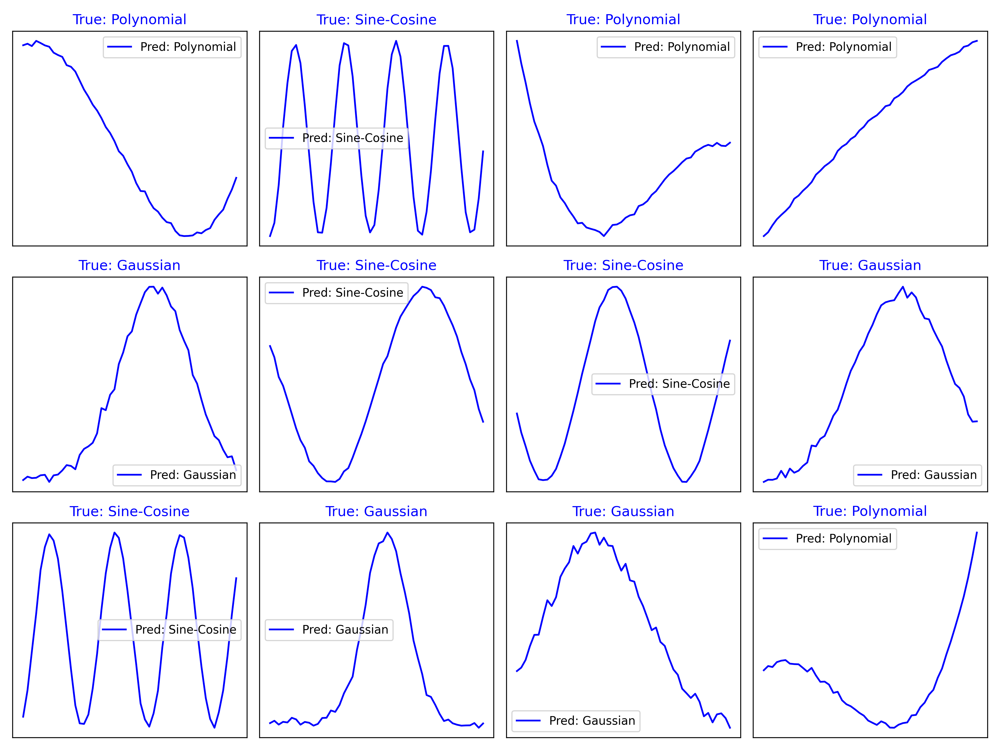
_Figure: Example CNN test predictions on function-classification inputs._

### LSTM-based anomaly detection in sensor data

- LSTM: Long Short-Term Memory network
  - Type of recurrent neural network (RNN) designed to handle sequential data (time series, text, sensor streams)
  - Learns long-term dependencies
  - Avoids vanishing/exploding gradient problems of vanilla RNNs
- How LSTM works:
  - Reads input sequence one timestep at a time
  - At each timestep, maintains internal cell state (long-term memory that the LSTM is trying to learn)
  - Also maintains hidden state (short-term memory) - output at each timestep used for predictions
  - Basic RNN repeatedly applies same transformation to combination of current input and previous hidden state
  - This repeatedly overwrites hidden state
  - Conversely LSTM has gates to control what info to keep, forget, and output
    - Forget gate: decides what info to discard from cell state
    - Input gate: decides what new info to add to cell state
    - Output gate: decides what to output as hidden state
  - So memory update is roughly:
    $$
    C_t = f_t \cdot C_{t-1} + i_t \cdot \tilde{C}_t
    $$
    where $C_t$ is cell state at time $t$, $f_t$ is forget gate, $i_t$ is input gate, and $\tilde{C}_t$ is candidate new info
    and:
    $$
    h_t = o_t \cdot \tanh(C_t)
    $$
    where $h_t$ is hidden state, $o_t$ is output gate, $\tanh$ is hyperbolic tangent activation function
- LSTM anomaly detection treats sensor stream as time series and uses LSTM to learn normal temporal behaviour

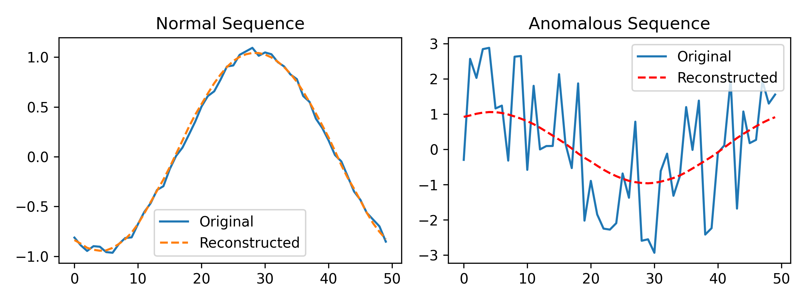
_Figure: LSTM-based anomaly detection on sensor time series data._

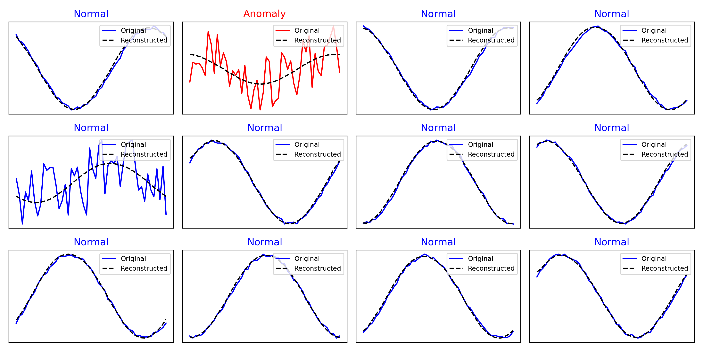
_Figure: Sample anomaly detection outputs highlighting detected events._

## Large Language Models

- Key terms: tokens, embeddings, context window, positional encoding, logits, sampling/temperature

- Logits: model’s raw scores for each class/token before converting into probabilities
  - In an LLM:
    - For each position in the sequence, the model outputs a vector of length `vocab_size`
    - Those numbers are the logits: higher = more likely, but they are not probabilities yet
    - Turn into probabilities using softmax:
      $$
      p(t_i) = \frac{e^{\mathrm{logit}(t_i)}}{\sum_{j} e^{\mathrm{logit}(t_j)}}
      $$
      where $t_i$ is token $i$.
  - Why use logits:
    - Training uses cross-entropy loss, which is numerically stable when
      computed from logits directly (PyTorch’s `CrossEntropyLoss` expects
      logits, not softmaxed probabilities)
    - Logits can be scaled by temperature during sampling: divide logits by $T$ before softmax (higher $T$ = more random)

### Transformers as sequence-to-sequence models

- Transformer: a neural network architecture
  - Stack of blocks doing self-attention and MLP
  - Trained by predicting next tokens or sequence-to-sequence
  - Uses attention to model relationships across a whole sequence (or set) in parallel
  - Dominant for language
  - Also used for time series and some spatial problems (with adaptations)

### Implementing and training a simple transformer-based LLM

Given a corpus of text:

1. Clean and preprocess the text (minimal normalisation (whitespace/newlines))
1. Tokenise the text into subword tokens (e.g. using Byte Pair Encoding (BPE) or Unigram)
1. Create a vocabulary mapping tokens to unique IDs
1. Make training sequences of fixed length (context length $T$, e.g. 128-2048 tokens) with corresponding target tokens (next token prediction)

   - For each chunk of $T$ tokens:
       - Input: tokens $[t_1, t_2, ..., t_T]$
       - Target: tokens $[t_2, t_3, ..., t_{T+1}]$

1. Define transformer model architecture:

   - Token embedding (embedding layer to convert token IDs to dense vectors)
   - Positional encoding to add token position info (sinusoidal or learned)
   - Stack of transformer blocks; each block:
       - Multi-head self-attention layera (masked so future tokens not seen)
       - Feed-forward MLP (two linear layers with ReLU/GELU activation in between)
       - Layer norm and residual connections in each sub-layer
   - Final linear layer to project to vocabulary size (logits for next token prediction)

1. Define loss function (cross-entropy between predicted logits and target tokens)
1. Training loop; per step:

   - Sample batch of input-target sequences
   - Forward pass through model to get logits
   - Compute `loss`
   - Backpropagate loss to compute gradients (`loss.backward()`)
   - Update model parameters with optimiser (e.g. Adam): `optimiser.step()`
   - Zero gradients: `optimiser.zero_grad()` (for next step)

1. Repeat for many epochs until convergence

- Optimisation tricks:
  - Optimiser: AdamW (Adam with weight decay)
  - Learning rate scheduling (warmup then cosine/linear decay)
  - Gradient clipping (optional, to stabilise training (i.e. avoid exploding gradients))
  - Regularisation: dropout in transformer layers
  - Mixed precision training (float16)
  - Large batch sizes with gradient accumulation

- Evaluation
  - Track training and (optionally) validation loss
  - Overfit small dataset to verify implementation

- Inference
  - Provide initial prompt tokens
  - Run model autoregressively to sample next tokens:
    - At each step, get logits for next token
    - Convert logits to next token via sampling (e.g. greedy, top-k, nucleus)
    - Append token to input and repeat for desired length

### Installing and using local LLMs

- Local LLMs usually means: a model file and runtime (and often quantisation)


## Retrieval-Augmented Generation (RAG)

- RAG:
  - search
  - prompt assembly
- Concepts:
  - Chunking: splitting docs into retrievable pieces (size/overlap matters)
  - Embeddings: vector representations for similarity search
  - Vector database / index: store vectors + metadata, do nearest-neighbour retrieval
- Pipeline: prepare docs → embed → store → retrieve top-k → stuff into LLM prompt → generate answer
- Why RAG fails (bad chunks, wrong retrieval, missing metadata, prompt too long, stale index).

### Document preparation


### Embedding generation


### Local and hosted LLMs


### Vector databases, chunking and persistence


### End-to-end RAG pipelines


## Multimodal Large Language Models

### Fundamentals of multimodal LLMs

- Multimodal models still runs Transformer-like core
- Turns non-text inputs into something the core can process
- Modality encoder
  - Converts input like image into sequence of vectors (often called image tokens or visual embeddings)
  - Commonly a Vision Transformer (ViT) or similar
- LLM backbone
  - Transformer that does language modelling and reasoning over combined sequence
- Fusion mechanism (how modalities meet) typical patterns:
  - Cross-attention: LLM attends to visual embeddings while generating text
  - Early fusion: visual "tokens" inserted into token stream alongside text
  - Adapter/projection layers: map image-encoder features into LLM’s embedding space
- Most trained with some mix of:
  - Image–text alignment: learn that an image and its caption match
  - Image captioning/visual question answering: generate text conditioned on the image
  - Instruction tuning: follow multimodal prompts (e.g. describe, compare, extract, reason about)
- Some models also trained to generate images/audio, but many understanding-only (input multimodal → output text)
- "Understanding" in practice
  - Model doesn’t see pixels directly; sees features extracted by the encoder
  - Can answer questions by combining:
    - Recognition (what’s in the image/signal),
    - Retrieval from learned priors (general world knowledge),
    - Reasoning over what’s provided.

### Radar data access and interpretation


### Cloud-top height as a multimodal AI application


## Diffusion and Flexible Graph Networks

### Diffusion networks


### Flexible graph networks for sparse observations


### Graph structure exploration


### PyTorch Lightning and PyTorch Geometric

- What they are (training scaffolding; graph NN utilities)

- PyTorch Lightnin: framework on top of PyTorch that structures/automates the training plumbing
  - I.e. training loops, logging hooks, checkpoints
  - While keeping model code in PyTorch
  - Helps with engineering features: mixed precision, multi-GPU/distributed training, etc.

- PyTorch Geometric (PyG)
  - PyTorch-based library to build and train GNNs for graph/irregular structured data
  - Provides standard graph layers, data structures, loaders, and utilities to work with graph data
  - Aimed at irregular inputs such as graphs (and related structures)

## Agents and Coding with LLMs

### Automated coding with LLMs


### Overview of agent frameworks


### LangChain for code design and execution


### LangGraph-based forecast assistant


## DAWID, LLMs and Feature Detection

- Natural-language expert interface/system developed by DWD for intuitive access to AI applications

### DAWID frontend


### DAWID backend architecture


### APIs, tasks and function integration


### AI-based feature detection for fronts


## MLflow

### Experiment tracking and logging

- MLflow Tracking: logging params/metrics/artefacts and viewing runs in the UI
- MLflow terms: run, experiment, artefact, model registry

### Running an MLflow server


### Advanced features and model management


## MLOps

### Motivation and foundations

- Make ML work:
  - Repeatable
  - Testable
  - Deployable
  - Maintainable
  in the real world

- Need to be able to:
  - Reproduce a result (same code, data, config, environment)
  - Compare experiments and avoid mystery improvements
  - Ship a model reliably (packaging, dependencies, interfaces)
  - Monitor performance and know when it degrades

- Considerations:
  - Version control
  - Data/versioning: which dataset snapshot produced which model (hashes, dataset IDs, immutable artefacts)
  - Environment management: pinned dependencies, often containers
  - Experiment tracking: log metrics/params/artefacts (e.g. MLflow) so runs comparable
  - Training pipelines: scripted, parameterised training (not ad-hoc notebooks), with deterministic seeds where possible
  - Model packaging: clear serveable artefact (weights, preprocessing, metadata) and a stable interface
  - Deployment: batch or service; CPU/GPU scheduling; rollback strategy
  - Monitoring: data drift, model drift, latency, error rates, alerting and retraining triggers
  - Governance: documentation, approvals, audit trail

- Checklist:
  - Freeze experiment into runnable package
    - E.g. move notebook logic into `train.py`, `infer.py`, `evaluate.py`, with clear entrypoint commands
  - Make configuration a first-class artefact: use YAML/Hydra (or equivalent), log the fully resolved config for every run
  - Ensure traceability: record code revision, config, data identifiers, metrics, and produced artefacts (e.g. via MLflow)
  - Pin runtime environment: lock dependencies; record CUDA/cuDNN/driver assumptions; containerise where feasible
  - Apply data discipline:
    - Immutable dataset snapshots/IDs
    - Versioned preprocessing
    - Explicit validation of units, grids, calendars, and conventions at I/O boundaries
  - Build evaluation ops will trust
    - Compare to operational baselines
    - Report skill by regime/season/region
    - Include reliability/uncertainty where relevant.
  - Design inference for integration:
    - Stable input/output schemas
    - Batch-friendly execution (chunking, streaming I/O, restartability)
    - Strong sanity checks (ranges, NaNs, missing timesteps)
  - Add CI/CD:
    - Unit tests for transforms and I/O
    - End-to-end smoke run for training and inference
    - Static checks (formatting, linting, optional typing)
  - Operational safeguards
    - Versioned model artefacts with metadata
    - Shadow/canary runs before impact
    - Explicit rollback to previous artefacts

### Containerisation and reproducibility

- GPU stack is part of environment:
  - Model results and correctness can depend on the exact CUDA toolkit, cuDNN, NCCL, and driver/runtime combination
  - Containerise user-space libraries, but document required host driver range and test on target GPU nodes
- Determinism not guaranteed by default:
  - Many GPU kernels non-deterministic (atomic ops, algorithm choices)
  - For bitwise repeatability, set seeds and enable deterministic modes (with a performance cost) and record that choice
- Library versions change numerics:
  - PyTorch, BLAS/MKL, cuDNN, and compiler flags can alter floating-point behaviour
  - Pin versions and record in artefact metadata
- Inference vs training environments can diverge
  - Training images often need compilers/build tools, while inference should be slim and stable
  - Common to use multi-stage build: "builder/training" and "runtime/inference"
- Data and model artefacts as important as code
  - Containers don’t solve data drift
  - Make datasets addressable (hash/ID)
  - Bake small test fixtures into repo
  - Store trained weights plus preprocessing code/config as versioned artefacts
- Reproducible preprocessing:
  - ML pipelines often include stochastic augmentation, shuffling, and windowing
  - Log augmentation parameters, random seeds, and dataset split definitions
  - Consider saving exact index lists for train/val/test
- Hardware-sensitive performance paths
  - Mixed precision, TF32, and specific GPU architectures can change speed and sometimes accuracy
  - Record settings like AMP on/off, TF32 allowed, matmul precision, batch size
- Distributed training adds more moving parts
  - Multi-GPU/multi-node runs depend on NCCL versions, network fabric, launcher settings
  - Containerise training stack and keep launch scripts/config alongside code
- Security and provenance:
  - Build from pinned base images
  - Minimise what’s inside
  - Scan images
  - Tag images immutably (digest) so "the container" is a specific artefact, not a moving label

### DevOps practices in weather services


## CI/CD for ML Code

### CI/CD concepts and motivation


### Tools and frameworks


### Testing with Pytest


### Runners and cloud integration


### CI/CD for ICON, AICON and Anemoi


## Anemoi: AI-Based Weather Modelling

### YAML, Hydra and OmegaConf

- Hydra/OmegaConf: hierarchical YAML configs, composition, and CLI overrides
- Very common in research-to-prod ML
- Hydra patterns: `python train.py model=... optimiser.lr=...`

- OmegaConf:
  - Python library for hierarchical YAML configuration
  - With merging/composition from multiple sources (files, CLI overrides, environment variables)
  - Supports structured configs / runtime type safety (useful for keeping ML configs sane as they grow)
  - Often used underneath Hydra (Hydra builds the composition/override workflow; OmegaConf holds the config object)

### Anemoi framework overview


### Zarr and ERA datasets

- Zarr is chunked for parallel access
    - Designed for object storage / cloud native

### Icosahedral graph construction


### Training and validation


### End-to-end training pipelines


## The AI Transformation

### From manual workflows to AI-assisted pipelines


### Process restructuring and tool integration


### Changing roles: guidance, supervision, validation, design


### Faster iteration via automation and rapid prototyping


### New skills: problem formulation, model-aware reasoning, critical assessment


## Model Emulation, AIFS, AICON and More

### AIFS: ECMWF flagship model


### AICON trained on ICON-DREAM


### BRIS stretched-grid approach


## AI Data Assimilation

### Introduction to AI-based data assimilation


### Training approaches: AIDA and AI-VAR

- AIDA - AI data assimilation
  - Named DWD effort/framework: “building a general framework for AI-based data assimilation → AIDA”
  - I.e. a specific project line growing out of DWD's AI-Var work

- AI-VAR - using variational DA ideas inside an ML pipeline
  - Learns the variational DA solver with a neural networka
  - Training uses the variational cost function as (or inside) the loss
  - So the method can, in principle, train from background and observations, without requiring a target analysis dataset

### AI ensemble data assimilation


## AI and Physics

### Extracting governing equations


### Physics-informed neural networks


### Embedding conservation laws


## Learning from Observations Only

### Direct observation prediction


### ORIGEN iterative model and data assimilation learning


### Interplay of human insight, modelling and machine learning


## Licence and copyright

Original course material © Roland Potthast and contributors, 2025–2026. [Creative Commons Attribution 4.0 International][cc-by]


Additional material © 2026 by M Sleigh is licensed under [Creative Commons Attribution 4.0 International][cc-by]


[cc-by]: https://creativecommons.org/licenses/by/4.0/
[eccodes-py]: https://github.com/ecmwf/eccodes-python
[pygrib]: https://jswhit.github.io/pygrib/
[cfgrib]: https://github.com/ecmwf/cfgrib
